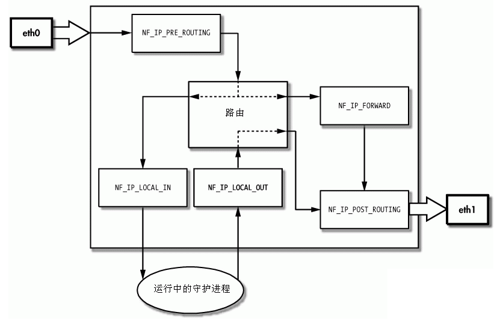

# iptables与NAT

  Linux系统中的防火墙，是由处于内核的`netfilter`框架以及用户空间的命令行工具`iptables`组成。Linux系统中`NAT`也是基于`netfilter/iptables`框架实现的。

## netfilter框架
  `netfilter`是一个包过滤(Packet Filter Framework)框架，其实现是在Linux内核的TCP/IP协议栈的包处理路径的5个关键点上设置`HOOK`，在`HOOK`点上可以注册处理函数，实现特定的功能。Linux中定义的5个`HOOK`点为：

* `IP_PRR_ROUTING`: 路由前，即数据包刚进入网络层，在进行路由判断其去向之前
* `IP_LOCAL_IN`: 经过路由查找，发往本机
* `IP_FORWARD`: 经过路由查找，需要被转发
* `IP_LOCAL_OUT`: 路由后，数据包被发送出去之前
* `IP_POST_ROUTING`: 本机发出的数据包

`netfilter`运行流程如下图所示：

  
  `netfilter`框架中，用表(table)来代表要实现的功能。目前`netfilter`中预定义了5个表，分别是：

* filter:
* nat:
* mangle:
* raw:
* security

## iptables用法

## Linux系统中的NAT配置

## Linux系统中NAT的实现
